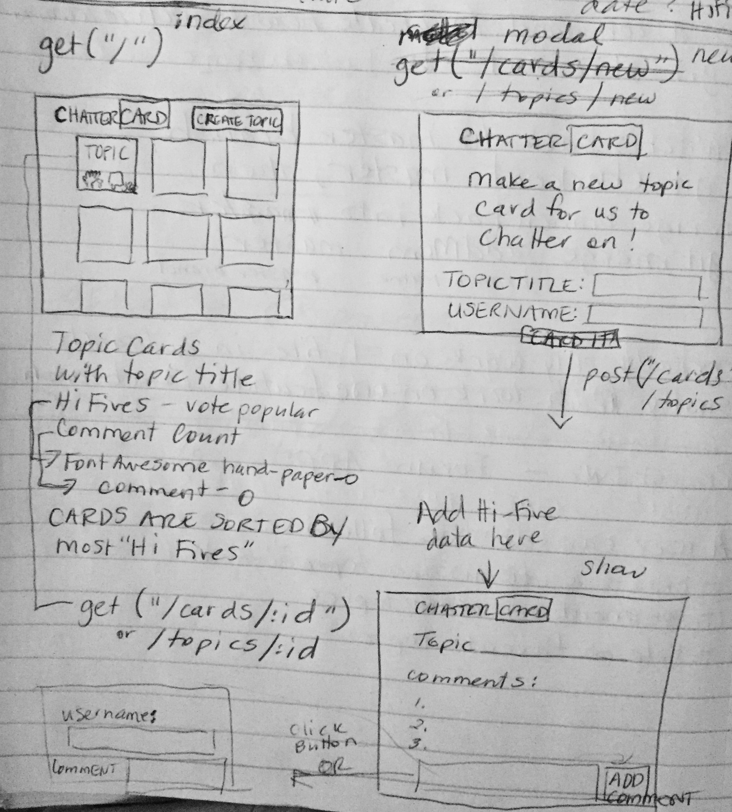
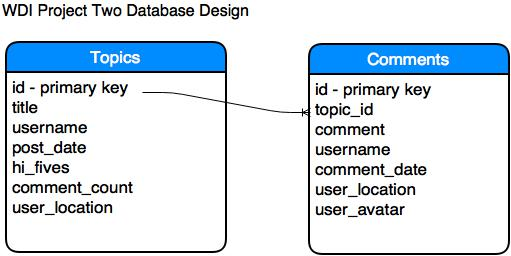

# WDI Project Two: Internet Forum

##Objective
To create a forum application in which users can create discussion topics and receive comments and "Hi-Fives" on those topics from other users.

###This project is hosted at:
http://104.131.61.18:3000/

##User Stories
Users Can Do the Following:
  1. Create a discussion topic.
  2. Comment on a discussion topic.
  3. "Hi-Five" favorite topics.
  4. See the number of "Hi-Fives" on a topic.
  5. Browse topics in order of most "Hi-Fives" to least.
  6. See the number of comments on a topic.
  7. See the location of the topic and comments.
  8. Receive a randomly assigned Avatar image.
  9. Interact with the application on mobile, tablet, or desktop device.

##Front-End Wireframes



##Pseudocode
**app.get("/")**

Read in index.html file
When a user clicks Create New Topic Button, a modal pops up which
they can enter their username and a topic title.

As new topics are created, they will be shown on the main index page.
Loop through rows in ejs template and output, sort the cards by Hi-Five count highest to lowest.

**app.post("/topics")**

Uses Telize API to get location info on post and adds city and state to database.

When they click CARD IT button, INSERT the user info into the Topics database table.

**app.get("/topics/:id")**

When a user clicks on a topic card, they are taken to show.html view which displays the topic at the top, date created, location, comments, and a field for comments to be added to the topic.

**app.post("/comments")**

When a user wants to add a comment(Chatter), they fill in username and click the Submit Chatter Button.  

Uses Telize API to get location info on post and adds city and state to database.

An Avatar image is randomly assigned from an array of image URLs to the user, which is added to the comment database

The current comment count is selected from the database and incremented up by 1 each time a new comment is added and the record is updated in the database.

**app.put("/topics/:id/edit")**

This is the counter for updating Hi-Five count, which grabs the current Hi-Five count for the current topic from the database and increments the count up by 1 and the record is updated in the database.

##Routes
This application uses the following routes:
```  
get("/")  
get("/topics/:id")
post("/topics")
post("/comments")
put("/topics/:id/edit")

```

##Database Design


